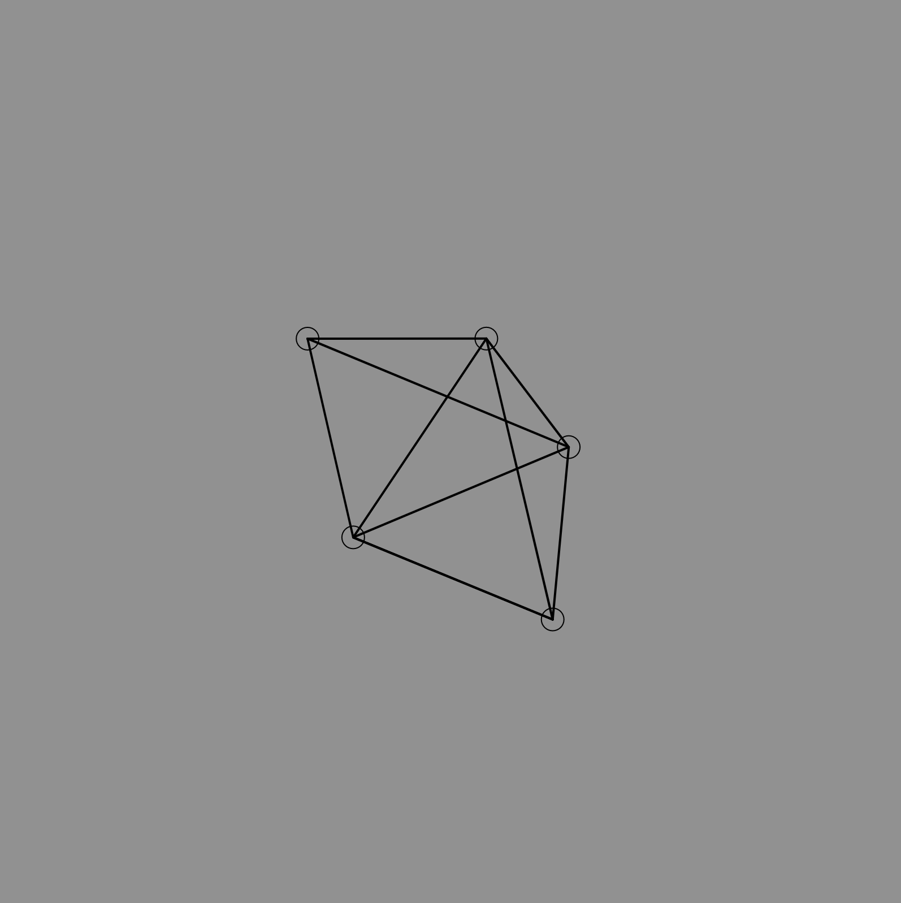
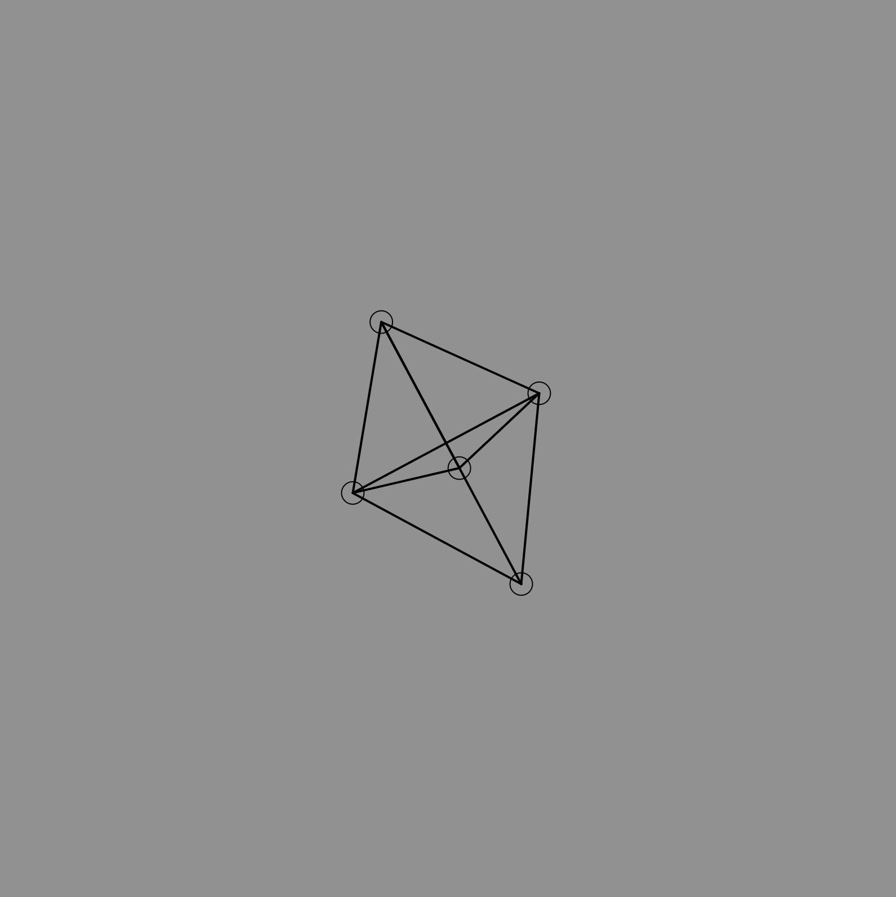
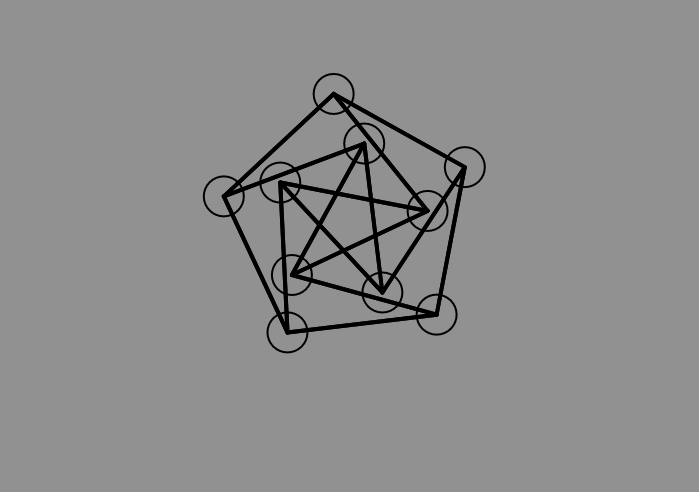

# Matrix-to-Graph
Simple thing to turn an adjacency matrix into a graph and then visualize said graph.
Graph will spaced out properly automatically thanks to a
force directed graph layout algorithm.

;
